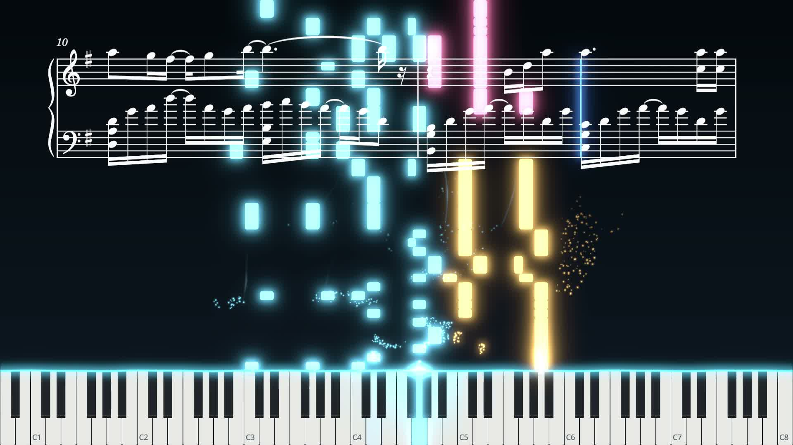

  简体中文 | [English](README.en.md)

  

  # Trifle

  **Nothing special. Until it is.**

  开源 MIDI 钢琴可视化工具 —— 乐谱同步 · 特效渲染 · 视频导出

  

  **[▶ 示例视频（哔哩哔哩）](https://www.bilibili.com/video/BV1Aqps6eEjr/)**

## 功能特点

- **钢琴可视化**：音符与键盘联动命中，接触线、键盘灯光、粒子、辉光等效果均可独立调节
- **乐谱同步**：配合 MuseScore 4 显示乐谱与演奏光标，随播放同步移动，支持与记谱不完全一致的 MIDI
- **通用 MIDI**：直接打开 `.mid` 即可播放与可视化
- **多种背景**：支持图片、纯色、渐变、视频
- **音频挂载**：外接音频可设偏移，导出时编码为 AAC 音轨
- **视频导出**：1080p / 1440p / 4K · 24 / 30 / 60 FPS · H.264 / H.265，逐帧渲染
- **工程管理**：可视化设置保存为工程文件，支持自动恢复

## 环境要求

- Windows 10 / 11（64 位）

## 可选依赖

- **FFmpeg**（视频导出、背景视频）：从[官网](https://ffmpeg.org/download.html#build-windows)下载，添加至 PATH 环境变量，或放置 `ffmpeg.exe` 到程序同目录即可
- **MuseScore 4**（乐谱同步）：程序会自动探测安装位置，也可在乐谱设置面板手动指定

## 从源码构建

1. 安装 [Godot 4.7.2 .NET 版](https://godotengine.org/download)
2. 用 Godot 打开工程目录，或执行 `dotnet build Trifle.sln`

## 第三方声明

随包分发的第三方组件（Godot Engine、DryWetMIDI、.NET Runtime）许可见 [licenses/THIRD-PARTY-LICENSES.txt](licenses/THIRD-PARTY-LICENSES.txt)。
